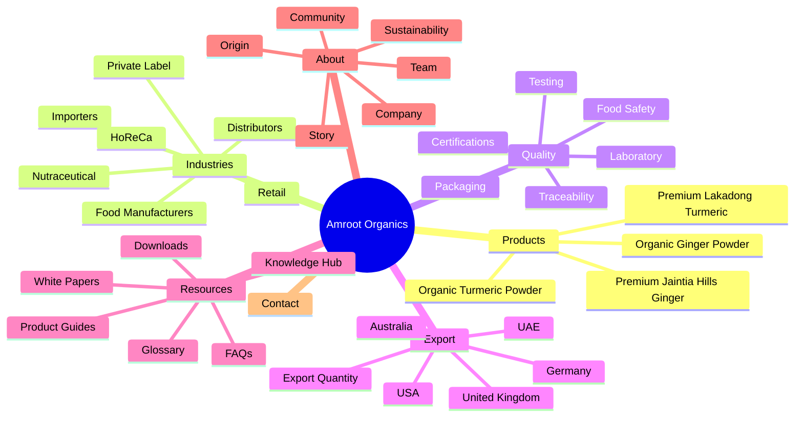
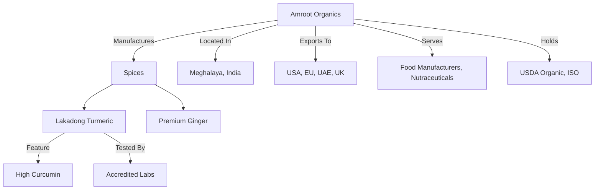

# Sprint 05: Information Architecture Engine

This sprint focuses **only** on the structural foundation and Information Architecture (IA) of Amroot Organics. No visual redesigns, no content implementation, and no product SEO will be done here—only the scaffolding and strategic mapping.

## Objective
Transform the current website into a structured, scalable B2B knowledge platform optimized for Search Engines (Google, Bing), AI Overviews (ChatGPT, Gemini, Claude, Perplexity), and International Procurement Managers.

---

## 1. Complete Information Architecture Diagram & Sitemap

---

## 2. URL Hierarchy & Navigation

Keep URLs semantic, short, and future-proof.

| Current URL | Proposed New URL (Target) | Reason for Change |
| --- | --- | --- |
| `/export-quality` | `/quality` | Broader parent category for all quality topics. |
| `/export-quantity` | `/export/quantity` | Logical grouping under export operations. |
| `/trace` | `/quality/traceability` | Traceability is a subset of quality/safety. |
| `/origin` | `/about/origin` | Origin story is part of the brand's identity. |
| `/community` | `/about/community` | Community is part of the brand's identity. |
| `/learn/*` | `/resources/*` | "Resources" is a more standard B2B procurement term than "Learn". |
| `/learn/knowledge-hub` | `/resources/knowledge-hub` | - |
| `/learn/faqs` | `/resources/faqs` | - |
| `/learn/certifications` | `/quality/certifications` | Belongs natively under Quality. |

---

## 3. Buyer Journey Map

| Persona | Landing Page | Required Info | Trust Signals | Conversion Path (CTA) |
| --- | --- | --- | --- | --- |
| **Importer / Distributor** | `/export` | Shipping terms, MOQs, Customs docs | COA, Organic Certifications | Request Bulk Pricing |
| **Food Manufacturer** | `/industries/food-manufacturers` | Mesh size, flavor profiles, consistency | ISO, Dedicated Processing | Request Samples |
| **Nutraceutical** | `/products/lakadong-turmeric` | High Curcumin %, Lab tests | Heavy metal/pesticide reports | Request Spec Sheet |
| **Private Label** | `/industries/private-label` | Packaging capabilities, white-labeling | Factory tours, capacity | Contact Sales |

---

## 4. Search Intent Map

Every page is classified with a singular primary search intent:

- **Commercial / Transactional:** 
  - `/products/*` (e.g., Buy bulk Lakadong Turmeric)
  - `/export/quantity` (Request bulk pricing)
- **Navigational:** 
  - `/about`, `/contact`, `/resources/downloads`
- **Informational:** 
  - `/resources/knowledge-hub/*` (e.g., What is the difference between organic and regular turmeric?)
  - `/quality/testing` (How we test for heavy metals)

---

## 5. Entity Relationship Map (AI Discoverability)

To help AIs (ChatGPT, Perplexity, Gemini) connect the dots:

---

## 6. Content Hub & Internal Linking Strategy

**Topic Cluster Example: Organic Turmeric**
- **Pillar Page:** `/products/organic-turmeric`
- **Cluster Content (Internal Links pointing back to Pillar):**
  - `/resources/knowledge-hub/curcumin-benefits`
  - `/quality/testing` (Heavy metals in turmeric)
  - `/about/origin` (Meghalaya farming)
  - `/export/usa` (Importing turmeric to USA)

**Internal Linking Rules:**
1. No orphan pages. Every product links to relevant industries and quality standards.
2. Every industry page links back to the products they use.
3. Breadcrumbs on every page (e.g., `Home > Products > Organic Turmeric`).

---

## 7. Download Architecture

A centralized location for procurement assets, naturally fitting into the hierarchy:
- `/resources/downloads` (Main Hub)
  - `/resources/downloads/spec-sheets` (Technical specs)
  - `/resources/downloads/coas` (Certificates of Analysis)
  - `/resources/downloads/company-profile` (Brochures)

---

## 8. Scalability Report

This architecture is deeply scalable:
- **100+ Products:** Add under `/products/[category]/[product-name]`.
- **30+ Countries:** Add under `/export/[country-name]`.
- **500+ Articles:** Filterable under `/resources/knowledge-hub/`.
- **New Industries:** Add under `/industries/[industry-name]`.
No core navigation or redesigns are required as the business scales globally.

---

## 9. Proposed Files Scaffold (To be Created / Moved)

If you approve this structure, I will execute the following file operations (creating empty scaffolding where needed):

### Folders to Move / Rename
- Move `/export-quality` -> `/quality`
- Move `/export-quantity` -> `/export/quantity`
- Move `/trace` -> `/quality/traceability`
- Move `/origin` -> `/about/origin`
- Move `/community` -> `/about/community`
- Rename `/learn` -> `/resources`
- Move `/resources/certifications` -> `/quality/certifications`

### Scaffolding to Create (Directories and `page.tsx` placeholders)
- `/industries/food-manufacturers`
- `/industries/retail`
- ... (all industries)
- `/export/usa`
- `/export/uk`
- ... (all export regions)
- `/quality/testing`
- `/quality/laboratory`
- ... (all quality pages)
- `/resources/downloads`

> [!IMPORTANT]
> Please review the URL hierarchy and proposed changes. If this architecture looks perfect, click "Proceed" and I will physically scaffold these directories and placeholder files in the codebase!
